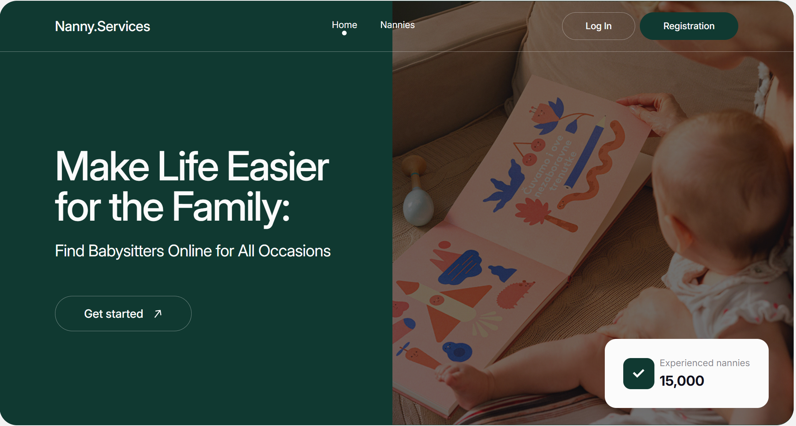

# Nanny Services App 🧸



This is a React-based web application for finding and booking nannies.  
Users can register, log in, browse nannies, add them to favorites, and make
appointments.

## 📝 Project Documentation

- **Design Mockup**:
  [Link to Figma mockup](https://www.figma.com/design/u36ajEOsnwio2GDGiabVPD/Nanny-Sevices?node-id=0-1&p=f&t=6pKDWmhgwmgRzXt4-0)
- **Technical Specifications**:
  [Link to the project requirements](https://docs.google.com/document/d/19ugM1gvOw81nCyALr4EZs3dmv6OfJm94VjupcytbnJY/edit?tab=t.0)

## 🚀 Features

- 👶 Browse a list of available nannies
- 💚 Add or remove nannies from favorites (stored in `localStorage`)
- 🕒 Book appointments via modal form
- 🔐 Firebase Authentication (Registration & Login)
- 📁 Firebase Realtime Database integration
- 🔍 Sorting & filtering options
- ✅ Form validation with `react-hook-form` and `yup`
- ⚙️ State management via Redux Toolkit
- 🧭 Routing with `React Router`
- 📱 Responsive layout (mobile-first)

## 🛠️ Technologies

- React
- Redux Toolkit
- React Router
- Firebase (Auth + Realtime Database)
- react-hook-form
- yup
- CSS Modules

## 📦 Installation

```bash
git clone https://github.com/valentyna88/nanny-services.git
cd nanny-services
npm install
npm start

```

The app will be available at http://localhost:5173.

## 🔒 Firebase Setup

Make sure to add your Firebase config in a .env file:

```
VITE_API_KEY=your_key
VITE_AUTH_DOMAIN=your_project.firebaseapp.com
VITE_DATABASE_URL=your_db_url
...
```

## 👩‍💻 Author

Created by Valentyna Taranchuk

- GitHub: https://github.com/valentyna88

- Gmail: valyataranchuk8@gmail.com
